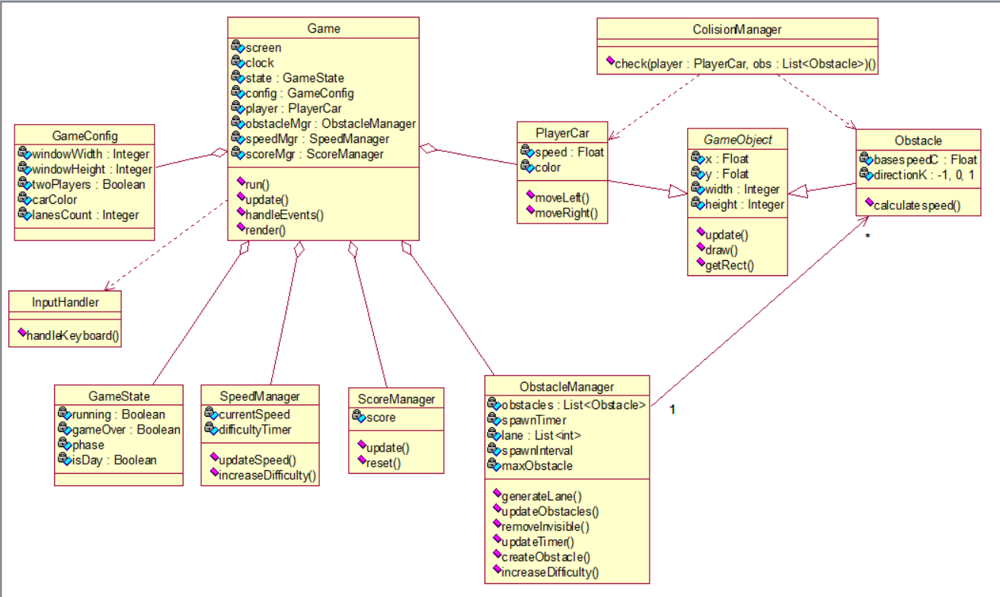

# 2D Racing Game (Python & Pygame) 🏎️

A collaborative high-performance arcade racing game developed as a 2nd-year student project. 
This project emphasizes clean Object-Oriented Programming (OOP), decoupled architecture through a 
Manager-based system, and advanced visual effects like dynamic multi-pass rendering.

## 🛠 Key Technical Features

### 1. Intelligent Traffic & Logic
* **Bidirectional Traffic ($k$-factor):** Simulation of two behaviors using motion coefficient $k$: Incoming ($k=1$) and Passing ($k=-1$).
* **Logarithmic Scaling:** Difficulty increases via $v_{i} = v + C \cdot k$, ensuring smooth velocity progression over time.
* **Predictive Spawning:** A lane-check algorithm that prevents "impossible" blocks and ensures zero collisions between obstacles on the same lane.
* **Resource Optimization:** Active memory management via automatic entity culling ($y - \frac{h}{2} > H_{window}$).

### 2. Physics & Competitive Mechanics
* **AABB Collision Detection:** Frame-by-frame Axis-Aligned Bounding Box validation for all game entities.
* **Versus Mode:** Dual-input system via `ScancodeWrapper` for independent, non-blocking control (WASD vs. Arrows).
* **CLI Validation:** Strict configuration integrity using `argparse.MutuallyExclusiveGroup` for game modes and car colors.
* **Data Persistence:** Real-time score calculation with local High-Score storage.

### 3. Advanced Rendering Pipeline
* **Multi-pass Lighting:** A 3-layer rendering system (**Base Layer** → **Darkness Mask** → **Light Pass**) for realistic night-time headlight effects without CPU overhead.
* **Dynamic Theming:** `ThemeManager` cyclically alternates between Day/Night modes every 15s, swapping assets and lighting on the fly.

### 4. System Architecture
The project follows a manager-based pattern to maintain a decoupled and scalable structure.


*UML Class Diagram showing relationships between the Game Engine, Managers, and Entities.*


## 👥 Team & Responsibilities

| Role | Developer | Key Contributions |
| :--- | :--- | :--- |
| **Core & Architecture** | **Daria Vysotska** | `GameState` management, Player logic, Design, CLI, and `ThemeManager` (Day/Night cycles). |
| **Math & Obstacles** | **Illya Marchuk** | Engine core, traffic $k$-factor algorithm, logarithmic speed scaling, obstacle collision avoidance and `SoundManager` (dynamic audio engine scaling).|
| **Logic & UI** | **Elizaveta Bondarenko** | AABB collision system, Versus mode implementation, HUD/UI, CLI, and high-score persistence. |

## 📝 Usage
The game features a robust Command Line Interface (CLI) built with argparse. This allows you to configure your race without touching the source code.

### Command Syntax
```bash
python main.py [-h] [--car-color COLOR | --players 2 [--car1-color COLOR] [--car2-color COLOR]]
   ```

## ⌨️ Controls

| Action | Player 1 (Arrows) | Player 2 (WASD) |
| :--- | :---: | :---: |
| **Move Left** | `Left Arrow` | `A` |
| **Move Right** | `Right Arrow` | `D` |
| **Start / Pause** | `Space` | — |
| **Exit** | `Esc` | — |

---

## 🚀 Getting Started

### Prerequisites
* **Python**: 3.8+
* **Pygame**: 2.0.1+

### Setup
 Clone the repository:
   ```bash
   git clone [https://github.com/your-username/Car-Racing-game.git](https://github.com/your-username/Car-Racing-game.git)
   ```
   
   ```bash
   cd Car-Racing
   ```